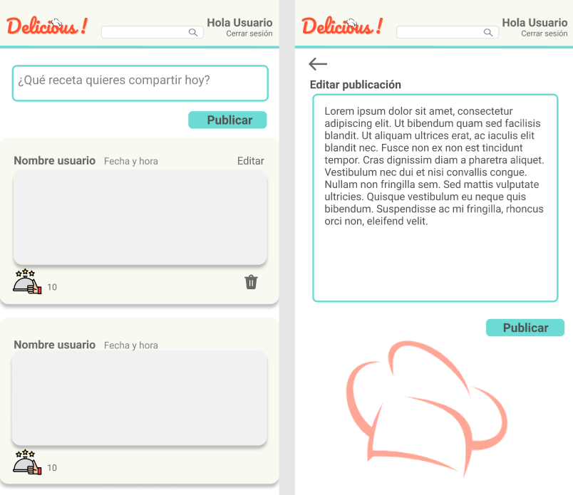

# Social Network
#### Link a proyecto
[Delicious! SN2 BOG003](https://camilaforer.github.io/BOG003-social-network/src/#/initial)

## Definición de producto

En este proyecto creamos la red social Delicious!, cuyos principales usuarios seran todos aquellos amantes de la cocina, que deseen compartir y buscar recetas. 
Con esto queremos generar una comunidad gastronomica donde sea más fácil encontrar ideas para cocinar y compartir los platos preferidos de cada usuario. 
La red social permite:

*Registrarse como nuevo usuario (Se pedira verifición del correo electronico registrado para posterior ingreso)
*Ingresar con correo y contraseña previamente registrados
*Ingresar con cuenta de Google
*Publicar, editar y borrar recetas 
*Buscar, dar y quitar likes a otras recetas 

## Investigación UX

Realizamos una encuesta a diferentes usuarios para definir el diseño de la red social donde se definio el nombre que llevaría, la paletas de colores a utilizar y el botón de like que se mostraría. 
Con base en estas respuestas se creo el prototipo de baja fidelidad y seguidamente en figma

**Diseño de baja fidelidad**

**Diseño para movil y tablet en figma**

Ingreso y registro:

Feed y edición de publicaciones

## Historias de usuario

### Historia de usuario 1
"Yo como usuario entusiasta de la buena cocina, quiero crear una cuenta de acceso en una red social sobre recetas de cocina y poder loguearme con esa cuenta, para no tener que hacer registro cada vez que quiera ingresar.

**Criterios de Aceptación:**
*Opción de ingresar a la página si ya es usuario registrado.
*La página tiene invitación a registrarse con correo electrónico o con cuenta de Google.
*Diseño acorde al tema de recetas de cocina.
*Debe poder visualizarla en diferentes dispositivos.

 **Definición de terminado:**
 *Debe estar aplicada la paleta de colores escogida y fuentes.
 *Tener logo listo.
 *Debe ser Single Page Application (Hacer ruteo).
 *Debe ser responsive.
 *Debe conectarse con Firebase.
 *Debe conectarse con Google.

### Historia de usuario 2
"Yo como usuario de Delicious!, quiero poder publicar recetas de cocina y poder editarlas y/o eliminarlas, para tener un perfil propio en la red."

**Criterios de Aceptación:**
*Al recargar la aplicación, se debe verificar si el usuario está logueado antes de mostrar contenido.
*Poder publicar un post.
*Poder dar y quitar like a una publicación. Máximo uno por usuario.
*Llevar un conteo de los likes.
*Poder eliminar un post específico.
*Pedir confirmación antes de eliminar un post.
*Al dar click en editar un post, debe cambiar el campo de texto por uno que permita editar el texto y luego guardar los cambios.
*Al guardar los cambios debe cambiar de vuelta a un texto normal pero con la información editada.
*Al recargar la página debo de poder ver los textos editados.

**Definición de terminado:**
*Construir el template de las publicaciones en javascript.
*Funcionalidad para verifiación de correo.
*Funcionalidad para crear colección de publicaciones con firebase.
*Funcionalidad para eliminar publicaciones propias.
*Funcionalidad para editar publicaciones propias.
*Funcionalidad para dar y quitar likes.

## Resultado final 

